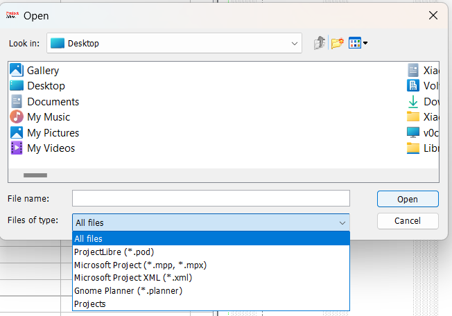
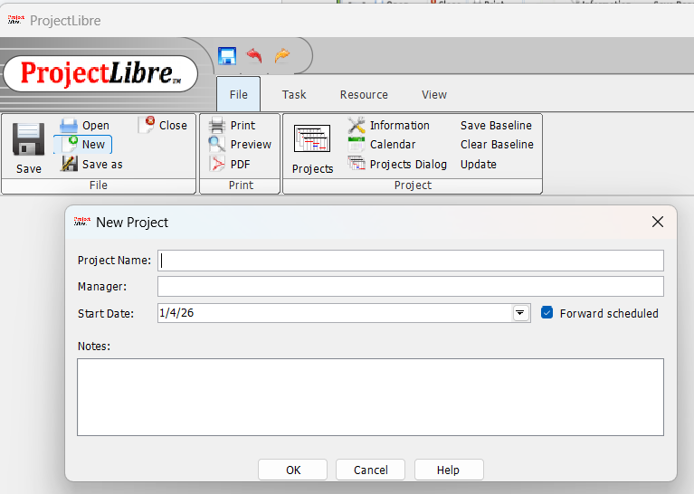
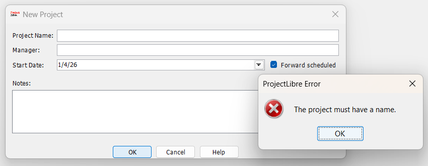
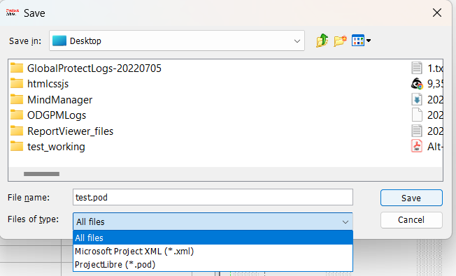

# ProjectLibre 2. Installing and Running

- [ProjectLibre 2. Installing and Running](#projectlibre-2-installing-and-running)
  - [2.1 Installing \& Running](#21-installing--running)
    - [Installing ProjectLibre](#installing-projectlibre)
    - [Running ProjectLibre](#running-projectlibre)
  - [2.2 Starting and Saving Projects](#22-starting-and-saving-projects)
    - [Open Existing Project](#open-existing-project)
    - [Create New Project](#create-new-project)
    - [Saving a Project](#saving-a-project)

## 2.1 Installing & Running

### Installing ProjectLibre

Download ProjectLibre Desktop from https://www.projectlibre.com/projectlibre-desktop/ or http://sourceforge.net/projects/projectlibre/.

### Running ProjectLibre

As of January 2026, the latest version is 1.9.8, the required Java is version 6 or later, which can be downloaded from http://www.java.com/en/download/index.jsp.

## 2.2 Starting and Saving Projects

### Open Existing Project

When choosing "Open Project", can select from `*.pod` or `*.xml`, full list supported in opening are as below:

- ProjectLibre (*.pod)
- Microsoft Project (*.mpp, *.mpx)
- Microsoft Project XML (*.xml)
- Gnome Planner (*.planner)
- Projects

### Create New Project

Choosing "Create Project" will pop up below dialog:

`Project Name` is the only mandatory field, missing that will cause below pop up error:

The `Forward scheduled` box is by default checked, it can be un-checked if you do not wish to use the Finish Date. Un-checking the `Forward scheduled` box changes the date entry to "Finish Date", which specifies the fixed Finish Date for the project.

### Saving a Project

The `*.pod` extension is native to ProjectLibre when saving.

Alternatively, using `Save as` allows you to save project in the Microsoft Project .xml format.

