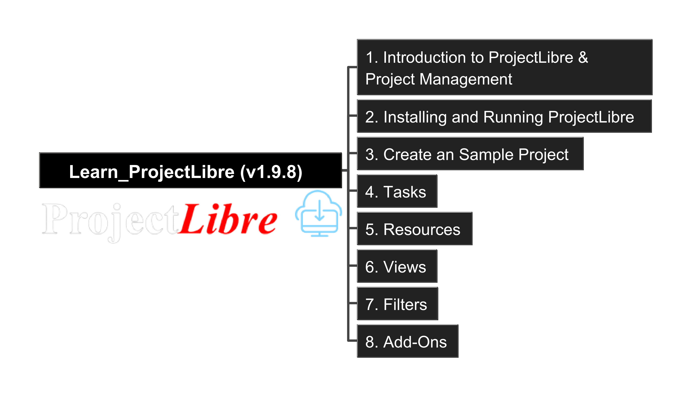

# Learn_ProjectLibre

Learn and share the usage of ProjectLibre as the open source project management tool

- [Learn\_ProjectLibre](#learn_projectlibre)
  - [About ProjectLibre Desktop](#about-projectlibre-desktop)
  - [Learning Contents](#learning-contents)

## About ProjectLibre Desktop

ProjectLibre desktop is free - open source project management software.

It is positioned as #1 alternative to Microsoft Project Free Project.

ProjectLibre offers Cloud, Artificial Intelligence and Desktop (we learn this one) solutions. Check https://www.projectlibre.com/projectlibre-desktop/ for more overview.

Join Community to find ProjectLibre:

- [http://projectlibre.org/](http://projectlibre.org/)
- [ProjectLibre on X(Twitter)](https://x.com/ProjectLibre)
- [ProjectLibre on YouTube](https://www.youtube.com/channel/UCpvll2xkdgLkj9cWQ2hm4PA)
- Source Code
  - [https://sourceforge.net/p/projectlibre/code/ci/master/tree/](https://sourceforge.net/p/projectlibre/code/ci/master/tree/)
  - [smartqubit/projectlibre](https://github.com/smartqubit/projectlibre)

## Learning Contents

Base on ProjectLibre V1.9.8, below is the structure of the learning documentation:

---

Last updated at: 1/4/2026, 1:57:50 PM 